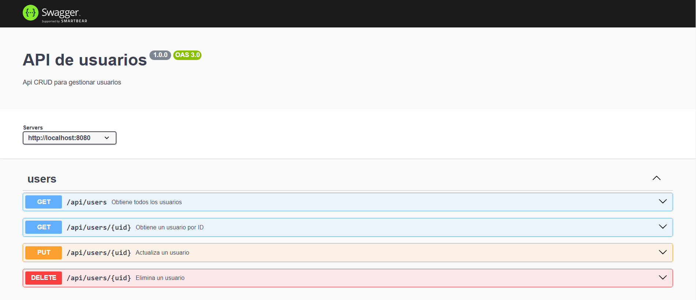
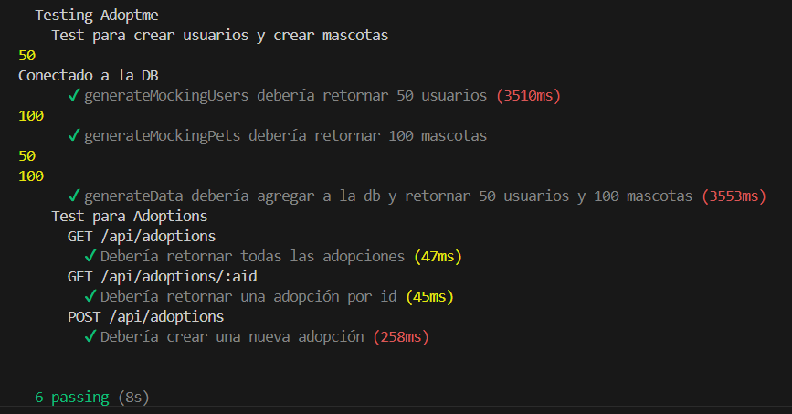
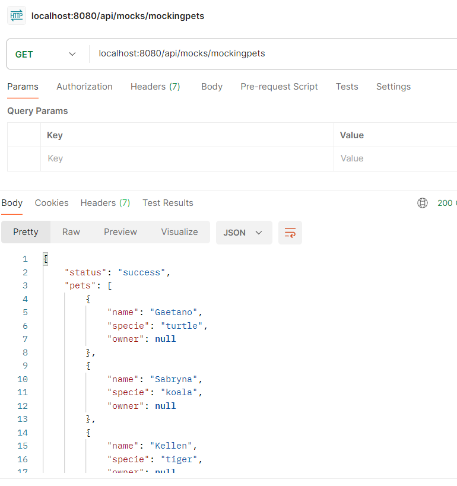
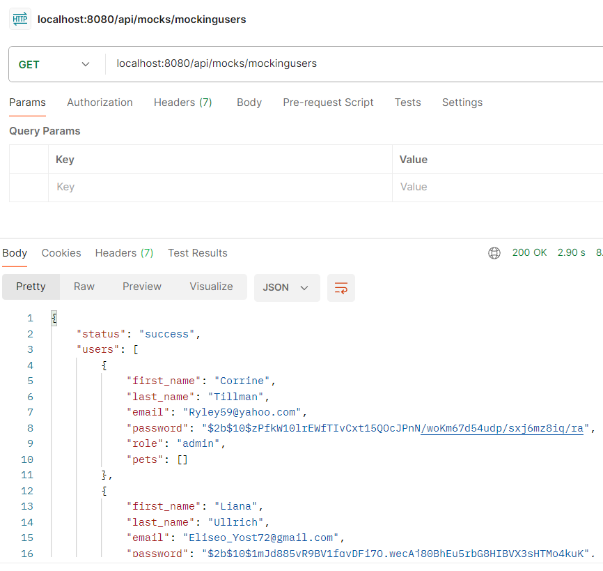
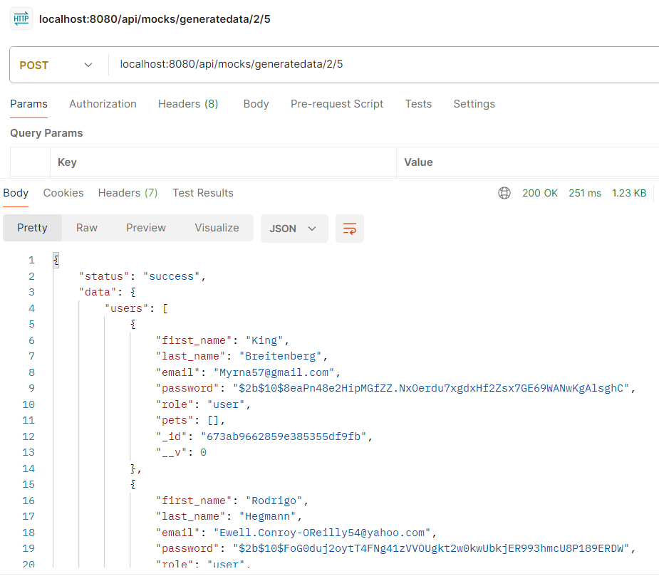

# Proyecto Backend III - Primera Entrega

## Índice
1. **Descripción General**  
2. **Requisitos**  
3. **Instalación**  
4. **Uso de la API**  
   - [GET /mockingpets](#1-get-mockingpets)  
   - [GET /mockingusers](#2-get-mockingusers)  
   - [POST /generateData](#3-post-generatedata)  
   - [GET /users](#4-get-users)  
   - [GET /pets](#5-get-pets)  
   - [Endpoints de Adopciones](#6-endpoints-de-adopciones)  
5. **Documentación con Swagger**  
6. **Testing**  
7. **Docker**  
8. **Notas Adicionales**  
9. **Imágenes**  

---

## Descripción General

Este proyecto es una API que incluye módulos para la generación de datos ficticios, gestión de usuarios, mascotas, y adopciones. Además, cuenta con documentación Swagger, test funcionales para los endpoints de adopciones, y un Dockerfile para generar imágenes del proyecto.

---

## Requisitos

- **Node.js**: Versión 18.17.1 o superior  
- **MongoDB**: Local o en la nube (por ejemplo, Mongo Atlas)  
- **Dependencias NPM**:
  - express
  - mongoose
  - @faker-js/faker
  - bcryptjs
  - jsonwebtoken
  - multer
  - swagger-jsdoc
  - swagger-ui-express
  - supertest
- **Dependencias para desarrollo**:
  - chai
  - mocha

---

## Instalación

1. Clonar este repositorio.
2. Ejecutar `npm install` para instalar las dependencias necesarias.
3. Configurar las variables de entorno. Un archivo `.env.example` está disponible como referencia:
    ```bash
    cp .env.example .env
    ```
4. Ejecutar el servidor:
    ```bash
    npm start
    ```

5. Opcional: Para ejecutar los tests funcionales:
    ```bash
    npm test
    ```

---

## Uso de la API

### 1. **GET /mockingpets**
**Descripción:** Genera una lista de mascotas simuladas.  
**Parámetros opcionales:**
- `cantPets`: Número de mascotas a generar (por defecto: 100).

**Ejemplo de uso:**
```bash
GET http://localhost:8080/api/mocks/mockingpets
```

### 2. **GET /mockingusers**
**Descripción:** Genera una lista de usuarios simulados.  
**Parámetros opcionales:**
- `cantUsers`: Número de usuarios a generar (por defecto: 50).

**Ejemplo de uso:**
```bash
GET http://localhost:8080/api/mocks/mockingusers
```

### 3. **POST /generateData**
**Descripción:** Genera usuarios y mascotas simulados y los almacena en la base de datos.  
**Parámetros obligatorios:**
- `users`: Número de usuarios a generar.
- `pets`: Número de mascotas a generar.

**Ejemplo de uso:**
```bash
POST http://localhost:8080/api/mocks/generatedata/1/3
```

### 4. **GET /users**
**Descripción:** Recupera todos los usuarios almacenados en la base de datos.

**Ejemplo de uso:**
```bash
GET http://localhost:8080/api/users
```

### 5. **GET /pets**
**Descripción:** Recupera todos las mascotas almacenadas en la base de datos.

**Ejemplo de uso:**
```bash
GET http://localhost:8080/api/pets
```

### 6. **Endpoints de Adopciones**
#### **GET /adoptions/**
**Descripción:** Recupera todas las adopciones registradas.

**Ejemplo de uso:**
```bash
GET http://localhost:8080/api/adoptions/
```

#### **GET /adoptions/:aid**
**Descripción:** Recupera la información de una adopción específica.  
**Parámetros:**  
- `:aid`: ID de la adopción.

**Ejemplo de uso:**
```bash
GET http://localhost:8080/api/adoptions/12345
```

#### **POST /adoptions/:uid/:pid**
**Descripción:** Crea una adopción asociando un usuario y una mascota.  
**Parámetros obligatorios:**  
- `:uid`: ID del usuario.  
- `:pid`: ID de la mascota.

**Ejemplo de uso:**
```bash
POST http://localhost:8080/api/adoptions/67890/12345
```

---

## Documentación con Swagger

La API está documentada con Swagger para facilitar la consulta y el uso de los endpoints.  
Para acceder a la documentación, ejecutar el servidor y visitar:  
```bash
http://localhost:8080/api-docs
```

Ejemplo de la estructura del usuario y rutas documentadas:  



---

## Testing

Se implementaron tests funcionales para los endpoints del módulo de adopciones (`adoptions.router.js`).  
**Tecnologías utilizadas:**  
- **Mocha**  
- **Chai**  
- **Supertest**

**Ejemplo de salida de los tests:**  


---

## Docker

**URL Imagen Docker: https://hub.docker.com/repository/docker/facustazione/backend3-entrega1/general**

Se incluye un `Dockerfile` que permite generar una imagen del proyecto. La imagen está publicada en **Docker Hub** y puede ser descargada ejecutando:  
```bash
docker pull facustazione/backend3-entrega1
```

**Ejemplo de uso con Docker:**  
1. Crear un contenedor:
    ```bash
    docker run -p 8080:8080 -d facustazione/backend3-entrega1
    ```
2. Acceder a la API en:  
    ```bash
    http://localhost:8080
    ```

---

## Notas Adicionales

- **Contraseñas:** Las contraseñas de los usuarios están encriptadas con bcrypt.  
- **Roles:** Los usuarios tienen roles aleatorios (`user` o `admin`).  
- **Relaciones:** Las mascotas generadas no tienen un dueño asignado por defecto.  

---

## Imágenes

1. **Mocking Pets**  


2. **Mocking Users**  


3. **Generate Data**  


4. **Swagger Documentation**  


5. **Testing Adoptions**  


---

## ¡Gracias por llegar hasta aquí! 🚀
