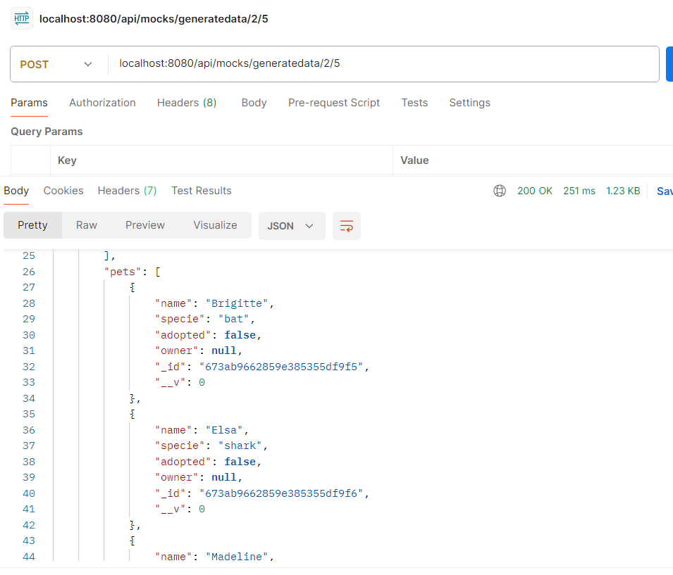
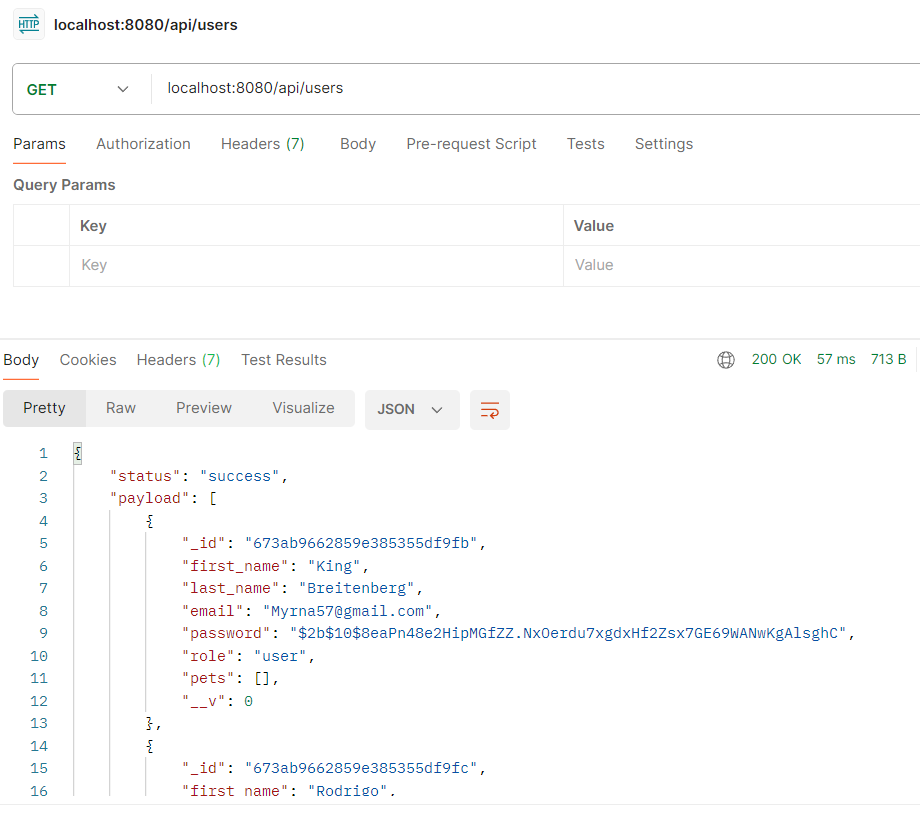
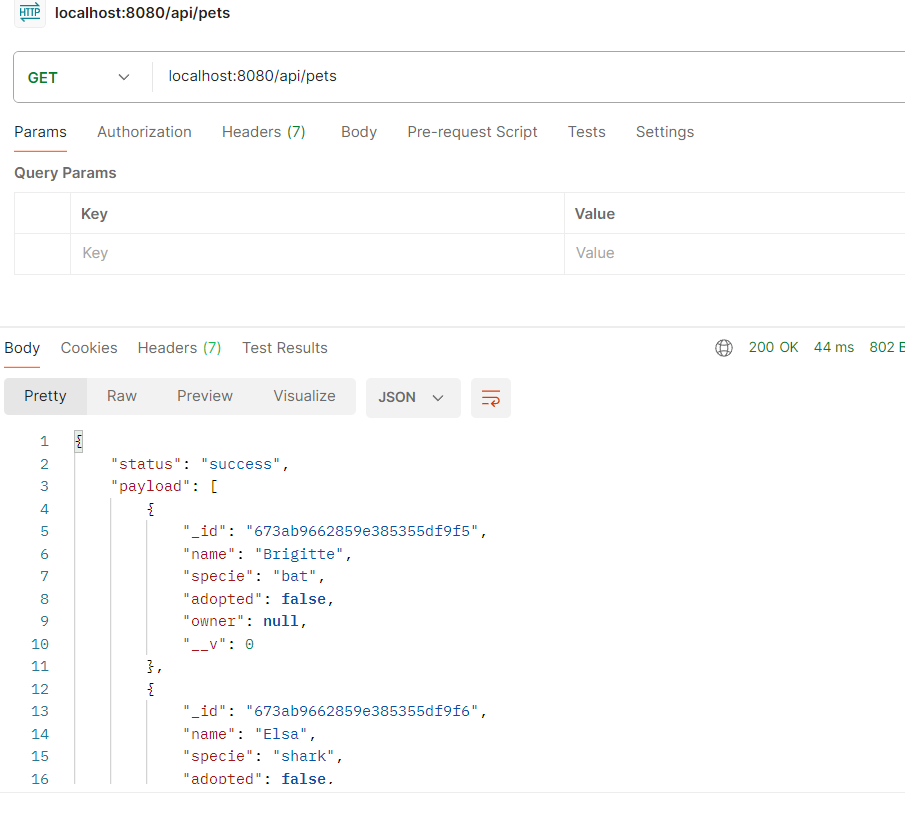

# Proyecto Backend III - Primera Entrega

## Índice
1. **Descripción General**  
2. **Requisitos**  
3. **Instalación**  
4. **Uso de la API**  
   - [GET /mockingpets](#1-get-mockingpets)  
   - [GET /mockingusers](#2-get-mockingusers)  
   - [POST /generateData](#3-post-generatedata)  
   - [GET /users](#4-get-users)  
   - [GET /pets](#5-get-pets)  
5. **Notas Adicionales**  
6. **Imágenes** 

## Descripción General
Este proyecto es una API que incluye un router llamado `mocks.router.js`, el cual se encarga de manejar las rutas relacionadas con la generación de datos ficticios para usuarios y mascotas. Este proyecto está diseñado para ser ejecutado localmente utilizando Visual Studio Code (VSCode).

## Requisitos

- **Node.js**: Versión 18.17.1 o superior  
- **MongoDB**: Local o en la nube (por ejemplo, Mongo Atlas)  
- **Dependencias NPM**:
  - express
  - mongoose
  - @faker-js/faker
  - bcrypt (para encriptar contraseñas)


## Instalación
1. Clonar este repositorio.
2. Ejecutar `npm install` para instalar las dependencias necesarias.
3. Configurar las variables de entorno. Un archivo `.env.example` está disponible como referencia.
    ```bash
    cp .env.example .env
    ```
4. Ejecutar el servidor:
    ```bash
    npm start
    ```

## Uso de la API

### 1. **GET /mockingpets**
**Descripción:** Genera una lista de mascotas simuladas.  
**Parámetros opcionales:**
- `cantPets`: Número de mascotas a generar (por defecto: 100).

**Ejemplo de uso:**
```bash
GET http://localhost:3000/api/mocks/mockingpets
```

### 2. **GET /mockingusers**
**Descripción:** Genera una lista de usuarios simulados.  
**Parámetros opcionales:**
- `cantUsers`: Número de usuarios a generar (por defecto: 50).

**Ejemplo de uso:**
```bash
GET http://localhost:3000/api/mocks/mockingusers
```

### 3. **POST /generatedata**
**Descripción:** Genera usuarios y mascotas simulados y los almacena en la base de datos.
**Parámetros obligatorios:**
- `users`: Número de usuarios a generar.
- `pets`: Número de mascotas a generar.

**Ejemplo de uso:**
```bash
POST http://localhost:3000/api/mocks/generatedata/1/3
```

### 4. **GET /users**
**Descripción:** Recupera todos los usuarios almacenados en la base de datos.

**Ejemplo de uso:**
```bash
GET http://localhost:3000/api/users
```

### 5. **GET /pets**
**Descripción:** Recupera todos las mascotas almacenados en la base de datos.

**Ejemplo de uso:**
```bash
GET http://localhost:3000/api/pets
```
---

## Notas Adicionales
-**Contraseñas**: Las contraseñas de los usuarios están encriptadas con bcrypt.
-**Roles**: Los usuarios tienen roles aleatorios (user o admin).
-**Relaciones**:  Las mascotas generadas no tienen un dueño asignado por defecto.

---

## Imagenes

A continuación, se muestran ejemplos visuales de la funcionalidad de la API:

1. **Mocking Pets**

2. **Mocking Users**

3. **Generate Data**


4. **Get Users**

5. **Get Pets**


## ¡Gracias por haber llegado hasta aquí!